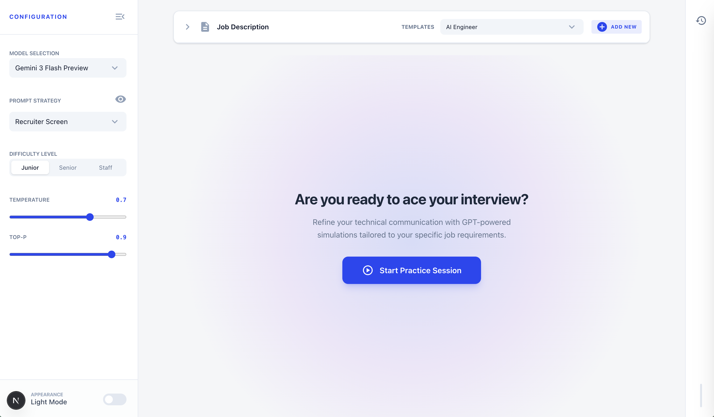
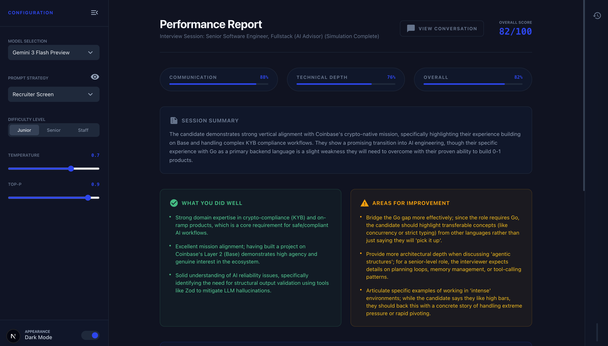

# AI Interview Prep Studio

A real-time, AI-powered technical interview simulator built with Next.js. Practice mock interviews tailored to specific job descriptions, receive live AI feedback, and get a detailed post-session performance report.


*Select an AI persona and define your job criteria to launch a customized, real-time mock interview.*

<br />


*Review a comprehensive post-session analysis detailing your strengths, areas for improvement, and actionable coaching.*

## Features

### 🎯 Multi-Model Architecture

The application supports Google Gemini and local models via Ollama:

| Stage | Model | Purpose |
|:---|:---|:---|
| **Interviewer** | Gemini 3 Flash Preview / Ollama | Low-latency streaming chat for realistic conversational flow |
| **Coach** | Gemini 3 Flash Preview / Ollama | Deep reasoning for post-session transcript analysis and scoring |

### 💬 Streaming Interview Chat

The core experience is a real-time, streaming conversation with an AI interviewer. Messages are streamed token-by-token, producing a natural interview cadence.

**Technical details:**
- Server-side streaming via the Vercel AI SDK's `streamText()` in `/api/chat/route.ts`
- Client-side `ReadableStream` decoding in `src/lib/store.ts` which progressively updates the global `messages` state
- `ActiveView.tsx` subscribes to these state changes via the `useAppStore` hook for real-time UI updates
- Configurable `temperature` and `topP` sliders that pass directly to the model's inference parameters

###  AI-Powered Performance Evaluation

When the user clicks "Finish Interview," the entire transcript is sent to the model for deep analysis. The model returns structured JSON with:

- **Overall Score** (0–100)
- **Technical Depth Score** (0–100)
- **Communication Score** (0–100)
- **Strengths** — What the candidate did well
- **Improvements** — Areas to work on
- **Coaching Example** — A structured before/after showing the original question, the candidate's answer, and a coached improvement
- **Session Summary** — A 2–3 sentence overview

The `EvaluationView` shows a loading animation while the model processes the transcript, then renders the scores as animated progress bars with color-coded feedback cards.

**Implementation:**
- `src/lib/ai/evaluationPrompt.ts` — Builds the evaluation prompt with full transcript, job context, and difficulty level
- `src/app/api/evaluate/route.ts` — Non-streaming `generateText()` call with JSON parsing
- `src/components/views/EvaluationView.tsx` — Loading state → error handling → dynamic rendering

### 🧠 5 Interview Personas (Prompt Strategies)

Each persona simulates a different interviewer the candidate might face during a real hiring loop. Each is backed by a distinct prompt engineering technique:

| Persona | Technique | Who You're Talking To |
|:---|:---|:---|
| Recruiter Screen | Zero-Shot | A Talent Acquisition Specialist — high-level background, motivation, and cultural fit |
| Hiring Manager | Zero-Shot | The Hiring Manager — STAR method evaluation of ownership, impact, and collaboration |
| Technical (Domain Knowledge) | Few-Shot | A Senior Engineer — few-shot examples calibrate the depth of domain-specific questions |
| Technical (System Design) | Zero-Shot | A Systems Architect — scalability, trade-offs, component selection, failure scenarios |
| Leadership (CEO) | Chain-of-Thought | The CEO — chain-of-thought reasoning to probe strategic thinking and business acumen |

### 🔧 How the AI Prompt is Assembled

The system prompt sent to Gemini is dynamically constructed at request time through a two-layer pipeline:

```
User selects a Persona (e.g. "Technical (Domain Knowledge)") in the sidebar
                              ↓
/api/chat/route.ts calls buildSystemPrompt(job, config)
                              ↓
promptBuilder.ts looks up SYSTEM_PROMPTS[config.strategy]
  → Retrieves the PromptStrategy object from systemPrompts.ts
  → Extracts its .content (the technique-specific instructions)
                              ↓
promptBuilder.ts assembles the FINAL system prompt by combining:
  ┌─────────────────────────────────────────────────────────────┐
  │ 1. PERSONA          — Role identity + conciseness rules    │
  │ 2. JOB DESCRIPTION  — The full job description text        │
  │ 3. INTERVIEW PARAMS — Difficulty level + persona name      │
  │ 4. STRATEGY CONTENT — The .content from systemPrompts.ts   │
  │                       (Few-Shot examples, STAR method,     │
  │                        Chain-of-Thought instructions, etc.)│
  │ 5. RULES            — "Ask ONE question at a time,"        │
  │                       "Don't provide answers," etc.        │
  └─────────────────────────────────────────────────────────────┘
                              ↓
Final assembled prompt is sent as the `system` parameter to Gemini
```

**Layer 1 — Strategy Fragments** (`systemPrompts.ts`):
Each persona is a `PromptStrategy` object with `content` (the actual prompt fragment), `description` (human-readable summary), and `technique` (the prompting method used). These are the building blocks.

**Layer 2 — Prompt Composer** (`promptBuilder.ts`):
Takes the selected strategy fragment and wraps it in the full interview context — the job description, difficulty level, persona identity, conciseness rules, and behavioral constraints. This is the final prompt Gemini receives.

**Implementation:**
- `src/lib/ai/systemPrompts.ts` — 5 persona prompt fragments, each using a specific prompting technique
- `src/lib/ai/promptBuilder.ts` — Assembles the master system prompt by injecting job context + strategy content
- `src/components/layout/StrategyDetailSidebar.tsx` — Slide-out panel showing the strategy description, technique, and raw prompt

### 💼 JobVault (Custom Job Persistence)

Users can select from built-in job templates or create their own:

- **5 built-in templates:** AI Engineer, ML Ops Specialist, Frontend Engineer, Backend Architect, Product Manager
- **"Add New" flow:** Input a custom title and description, then "Save to My Jobs"
- **Persistence:** Custom jobs are stored in `localStorage` via Zustand's `persist` middleware and appear in the template dropdown alongside built-in options

**Implementation:**
- `src/lib/store.ts` — `customJobs: JobConfig[]` with `addCustomJob()` and `removeCustomJob()` actions
- `src/components/features/JobConfigCard.tsx` — Merges `customJobs` with `JOB_TEMPLATES` in the dropdown

### 📜 Session History

Every completed interview is automatically saved with its full transcript, job configuration, and strategy settings. Users can:

- Browse past sessions in the History sidebar
- Reload any previous session's transcript
- Review evaluations from past interviews

**Implementation:**
- `src/lib/store.ts` — `HistorySlice` with `saveCurrentSession()` that snapshots messages, job, and config
- `src/components/layout/HistorySidebar.tsx` — Slide-out panel listing saved sessions
- `src/components/views/HistoryView.tsx` — Full session detail view with message replay

---

## Project Structure

```
src/
├── app/
│   ├── api/
│   │   ├── chat/route.ts          # Interviewer — streaming (Gemini or Ollama)
│   │   └── evaluate/route.ts      # Coach — evaluation (Gemini or Ollama)
│   ├── layout.tsx
│   ├── page.tsx
│   └── globals.css
├── components/
│   ├── features/
│   │   └── JobConfigCard.tsx      # Job template selection + custom input
│   ├── layout/
│   │   ├── AppShell.tsx           # Root layout with view routing
│   │   ├── HistorySidebar.tsx     # Past session sidebar list
│   │   ├── LeftSidebar.tsx        # Model, strategy, difficulty, temp/topP
│   │   ├── RightSidebar.tsx       # History toggle
│   │   └── StrategyDetailSidebar.tsx  # Prompt strategy inspector
│   ├── ui/
│   │   ├── Button.tsx
│   │   ├── Input.tsx
│   │   ├── Select.tsx
│   │   └── Slider.tsx
│   └── views/
│       ├── ActiveView.tsx         # Real-time chat & history replay
│       ├── EvaluationView.tsx     # AI-generated performance report
│       ├── HistoryView.tsx        # Session browser
│       └── IdleView.tsx           # Landing / setup screen
└── lib/
    ├── ai/
    │   ├── evaluationPrompt.ts    # Evaluation prompt builder
    │   ├── promptBuilder.ts       # System prompt composer
    │   └── systemPrompts.ts       # 5 strategy prompt definitions
    ├── constants.ts               # Models, strategies, difficulties, templates
    ├── store.ts                   # Zustand store (UI, Interview, Voice, History)
    └── utils.ts                   # cn() utility
```


## Tech Stack

| Layer | Technology |
|:---|:---|
| Framework | Next.js 16 (App Router, Turbopack) |
| Language | TypeScript |
| Styling | Tailwind CSS v4 |
| State Management | Zustand with `localStorage` persistence |
| AI SDK | Vercel AI SDK (`ai` + `@ai-sdk/google` + `ollama-ai-provider-v2`) |
| AI Provider | Google Gemini or Local Ollama |

## Getting Started

### Prerequisites
- Node.js 18+

### Setup

```bash
# Clone and install
git clone <repo-url>
cd interview-app
npm install

# Start the dev server
npm run dev
```

Open [http://localhost:3000](http://localhost:3000) to start practicing.

### Setup for Local Models (Ollama)

You can run your interviews entirely on your local machine using [Ollama](https://ollama.com/). No API key required.

1. **Install Ollama**: Download from [ollama.com](https://ollama.com).
2. **Pull a Model**: You need to download a model first. The app defaults to `gemma3`:
   ```bash
   ollama pull gemma3
   ```
3. **Start the Ollama Server**: Ollama must be running in the background. You need `OLLAMA_ORIGINS` set to allow browser connections. Ollama will automatically load the model when the app sends a request — no need to run the model separately.
   ```bash
   OLLAMA_ORIGINS="*" ollama serve
   ```
4. **App Configuration**: 
   - Set **Model Selection** to `Local (Ollama)` in the sidebar.
   - The **Local Model Name** field defaults to `gemma3`. Change this to match whatever model you pulled (e.g., `llama3`, `mistral`, etc.).
   - The **Base URL** defaults to `http://localhost:11434` — the app automatically appends `/api` as needed.


## Environment Variables

| Variable | Required | Description |
|:---|:---|:---|
| `GOOGLE_GENERATIVE_AI_API_KEY` | ✅ | Google AI Studio API key for Gemini access |
